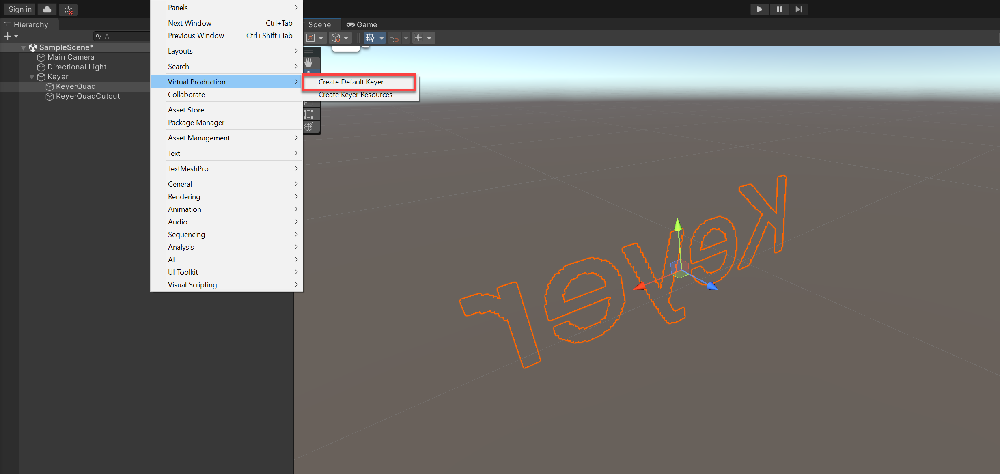

# Creating a default Keyer

You can create a default Keyer in one step. To create a default Keyer:

1. In the menu, select **GameObject > Virtual Production > Create Default Keyer**.  

 

 This creates the default GameObject, QuadKeyer, assigns an input texture, Keyer settings, applied materials, and default set of parameters. The hierarchy of objects is as follows:

 * **Keyer Container**: The parent object hosting the Keyer and the Keyer shadow. You can move this object rather than the children.
 * **Keyer**: Quad containing the actual Keyer. You can change the Keyer component settings in this GameObject.
 * **Keyer Shadow**: The shadow of the Keyer. The shadow is created by using a Quad located in the same location as the Quad on which the Keyer component is applied. This uses a mesh renderer that only casts shadows, with an opaque material with an alpha cutout. 
  
2. Optionally, change the input Foreground green screen texture to your own.

3. Optionally, provide a Garbage Mask texture.

4. Optionally, change the [render texture](https://docs.unity3d.com/2022.2/Documentation/Manual/class-RenderTexture.html). This resulting render texture can be used as the base texture for an unlit transparent material for integration into the scene.

5. Adjust the default [Keyer properties](keyer-property-reference.md) to achieve your desired effect.