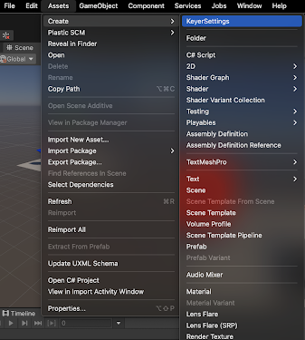

# Creating a KeyerSettings asset

The Keyer allows you to save a set of pre-configured keyer parameters as an asset in the project. You can then reuse this asset. 

To create a KeyerSettings asset:

1. In the menu, select **Assets >  Create > KeyerSettings**. The new KeyerSettings asset will be added to the **Assets** directory and will be named KeyerSettings by default.

  

2. Rename the new KeyerSettings asset as desired. For example, *MyPreferredKeyerSettings*.

3. Drag and drop your new KeyerSettings asset into the **KeyerSettings** field in the inspector.

4. Select and configure the parameters for the new asset. Your configured parameters are saved automatically.

5. Your new KeyerSettings asset will be saved with the settings and parameters that you have configured and can be reused in the future. The KeyerSettings are auto-saved even during play mode.

