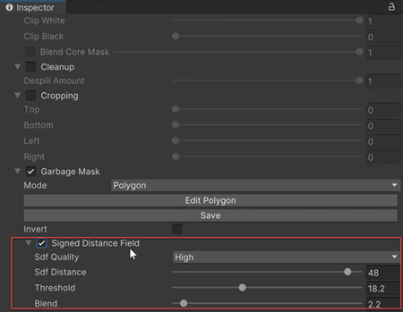

# Creating a Garbage Mask

You can use a Garbage Mask to hide or mask out a specific area of an input image. 
You can use either a Texture or draw a Polygon shape to create a Garbage Mask.

## Texture Garbage Mask

To use a saved texture to apply a Garbage Mask:

 1. Select the image that you want to apply the Garbage Mask to.

 2. Enable the **Garbage Mask** Checkbox.

 3. From the **Mode** drop-down, select *Texture*.

 

 4. Choose the saved **Texture** that you would like to use as a Garbage Mask.

 5. Optionally, select the **Invert** checkbox to reverse the masked and unmasked areas.

 6. Optionally, select **Signed Distance Field** and use the Quality, Distance, and Threshold parameters to dilate the mask. For more information, see [Keyer properties](keyer-property-reference.md).

 7. To add an opacity gradient to the edges of the Garbage Mask, adjust the **Blend** value.
 As you increase the value, the transition between protected and unprotected parts of the image becomes smoother.

## Polygon Garbage Mask

You can draw a polygon and use it as a Garbage Mask in the 2D Garbage Mask Editor.

To draw a polygon shaped Garbage Mask:

 1. Select the image that you want to apply the Garbage Mask to.

 2. Enable the **Garbage Mask** Checkbox.

 3. From the **Mode** drop-down, select *Polygon*.

 

 4. Select, **Edit Polygon**.
 The 2D Garbage Mask Editor opens.

 5. In the 2D Garbage Mask editor, click intermittently around the image to define the mask area. You can add points, delete points, and move them around.

 

 6. Select **Save** to save the polygon as a texture.

 7. Optionally, select the **Invert** checkbox to reverse the masked and unmasked areas.

 8. Optionally, select **Signed Distance Field** and use the Quality, Distance, and Threshold parameters to dilate the mask. For more information, see [Keyer properties](keyer-property-reference.md).

 

 9. To add an opacity gradient to the edges of the Garbage Mask, adjust the **Blend** value.
 As you increase the value, the transition between protected and unprotected parts of the image becomes smoother.
