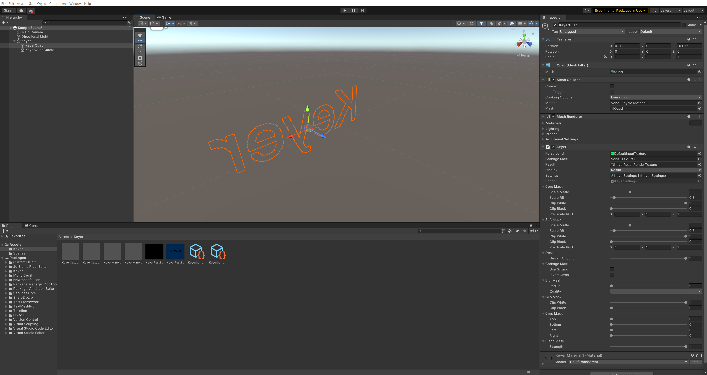

# Keyer package

>[!NOTE]
>To use the Keyer package, you must install it separately. For detailed information about package requirements and installation instructions, refer to [Installation](installation.md).

The **Keyer** package allows you to create an opacity mask for actors or objects filmed against a green screen.

## In this documentation

 | Section | Description |
 |:---|:---|
 | [Installation](installation.md) | Install the Keyer package and learn about the package requirements. |
 | [Concepts](keyer-concepts.md) | Understand the core concepts behind the Unity Keyer. |
 | [Features](keyer-features.md) | Learn about the features and capabilities of the Keyer package. |
 | [Getting started](getting-started.md) | Create a basic keyer and a garbage mask, use the Keyer Preview window, and learn about keyer properties and reusable keyer assets. |
 | [Samples](samples.md) | Install samples (provided along with the package) to explore more advanced Keyer configuration examples. |

_See also the full [table of contents](TableOfContents.md)_
