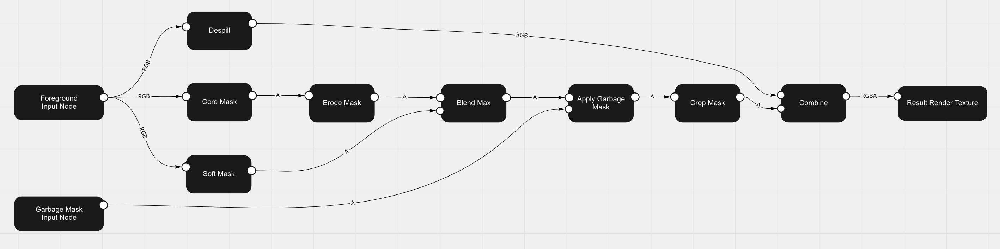

[Contents](TableOfContents.md) | [Home](index.md) > Keyer core concepts

# Keyer core concepts

The Unity Keyer separates a subject from its background information with segmentation algorithms. The Keyer identifies the green shades in the background and renders it as an alpha channel.

## Segmentation algorithms

We offer 2 segmentation algorithms, the **color difference**, and the **color distance**. The color difference algorithm as its name suggests computes the difference between the green channel and the larger of the red or blue channel to generate the mask. The color distance segmentation algorithm computes the distance between a selected color from the background and the foreground image.

## Core and Soft Mask

The Core Mask and Soft Mask enable you to apply multiple effects one after the other to achieve better results. The Core Mask is typically used for larger areas whereas the Soft Mask is used for smaller or fine details.

The following diagram shows how the input foreground image can be processed by the two separate segmentation nodes, the Core Mask and the Soft Mask.

 You can modify each of the mask's parameters independently. This allows for the Core Mask parameters to be set to create an opaque core for the foreground. This opaque Core Mask can then be eroded and then blended with the Soft Mask where you can set the segmentation parameters to have nice semi-transparent edges.
