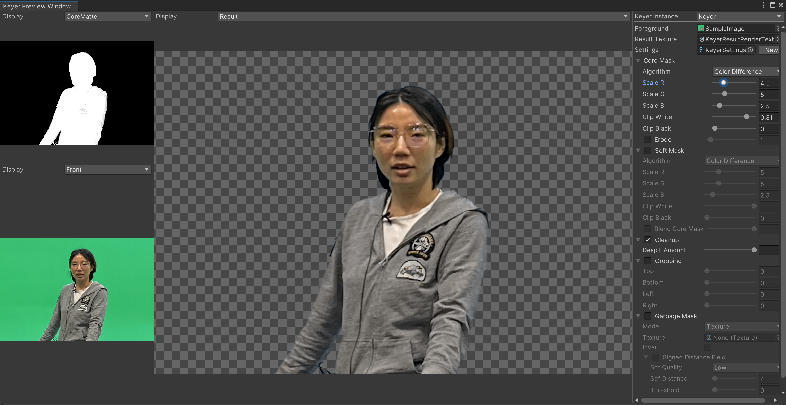

# Keyer features

The **Keyer** package supports the following features:

- Ability to create a default Keyer in one step.
- Core Mask and Soft Mask options that enable you to apply multiple effects one after the other to achieve better results.
- Erode, crop, invert, and blend mask options.
- Ability to create a texture and polygon Garbage Mask.
- A Keyer Preview Manager window.
- Color Distance and Color Difference algorithms.
- Samples of the Keyer for the Built-in, URP, and HDRP render pipelines.
- Public API in C#.

