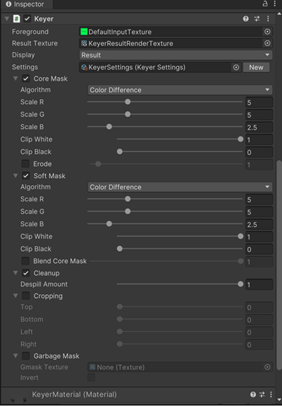
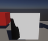
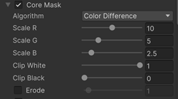
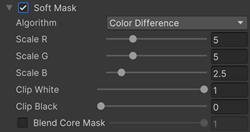
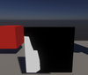

# Keyer properties

This section describes the Keyer Properties you can adjust according to your needs.

You can access the following **Properties**:

| **Property:**        | **Function:**               |
| :------------------- | :-------------------------- |
| __Foreground__ | The input Foreground green screen texture. |
| __Result Texture__ | The Keyer resulting render texture.|
| __Display__ | Use to visualize the intermediate results of the pipeline:  • **Result:** Displays the resulting image with the Key applied to it.    • **Core Matte:** Result of the image with the Core Mask applied.     • **Soft Matte:** Displays the result of the image with the Soft Mask applied.     •  **Erode Matte:** Displays the transparency from the edge of the Keyer inward.     • **Blend Max:** Blends the Core Mask and the Soft Mask together.    • **Front:** Displays the original input front image.     • **Garbage Mask:** Displays the applied Garbage Mask.     |
| __Settings__ | Optionally drag and drop a Keyer profile from a saved asset to load its default settings.|
| __Core Mask__ |Use this property for larger areas. You can choose between either the Color Distance or the Color Difference Keyer Algorithm. Adjust the rest of the [parameters](keyer-property-reference.md) to suit your needs.   |
| __Erode__ |Erode allows you to gradually increase transparency from the edge of the Keyer inward. |
| __Soft Mask__ | Use this property for smaller or fine details. Refines and improves detailed edges. You can choose between either the Color Distance or the Color Difference Keyer Algorithm. Adjust the rest of the [parameters](keyer-property-reference.md) to suit your needs.   |
| __Keyer Algorithm__ |Switches the Keyer Segmentation algorithms between Color Distance (YUV) and the Color Difference Green Screen Keyer. |
| __Color Distance__ | • **Key Color**: The color of the key representing the background. • **Threshold Range**: The range separating the foreground and the background.|
| __Color Difference__ | • One scaling factor per color channel (Red, Green, and Blue). • Recommended range: 0-5. A value of 0.5 works for most cases.|
| __Clip White__ | • Changes the white value in levels. • Recommended range: 1-0.7|
| __Clip Black__ | • Changes the black value in levels.  • All values below this value become black.  • Recommended range: 0-0.3|
| __Blend Core Mask__ |Blends the Core Mask. You can use the slider to increase or decrease the strength. |
| __Despill Amount__ | Use this property to get rid of the green spill in the image:  • 0 = no green spill removal. • 1 = full green spill removal.|
| __Cropping__ | The crop option removes elements around the actor not needed in the final composition. You can crop the Mask by using the **Top**, **Bottom**, **Right**, and **Left** parameters. |
| __Garbage Mask__ | The following parameters are available for Masking:   • **Enabled:** Activate to use a Garbage Mask to mask out parts of your image from view.  • **Mask Texture:** After a Garbage Mask is enabled, you can upload a Mask texture. • **Polygon:** After a Garbage Mask is enabled, you can draw a polygon shaped mask.  • **Invert:** Select the Invert checkbox to reverse the masked and unmasked areas.     • **Signed Distance Field:** Dilate the Garbage Mask using the Signed Distance Field algorithm.  • **Sdf Quality:** Set the quality of the Signed Distance Field algorithm from lowest to highest. • **Sdf Distance:** Set the distance of the dilation using the Signed Distance Field.  • **Threshold:** Set the minimum threshold where to apply the Signed Distance Field. • **Blend:** Blend the edge of the Signed Distance Field from opaque to transparent.|
