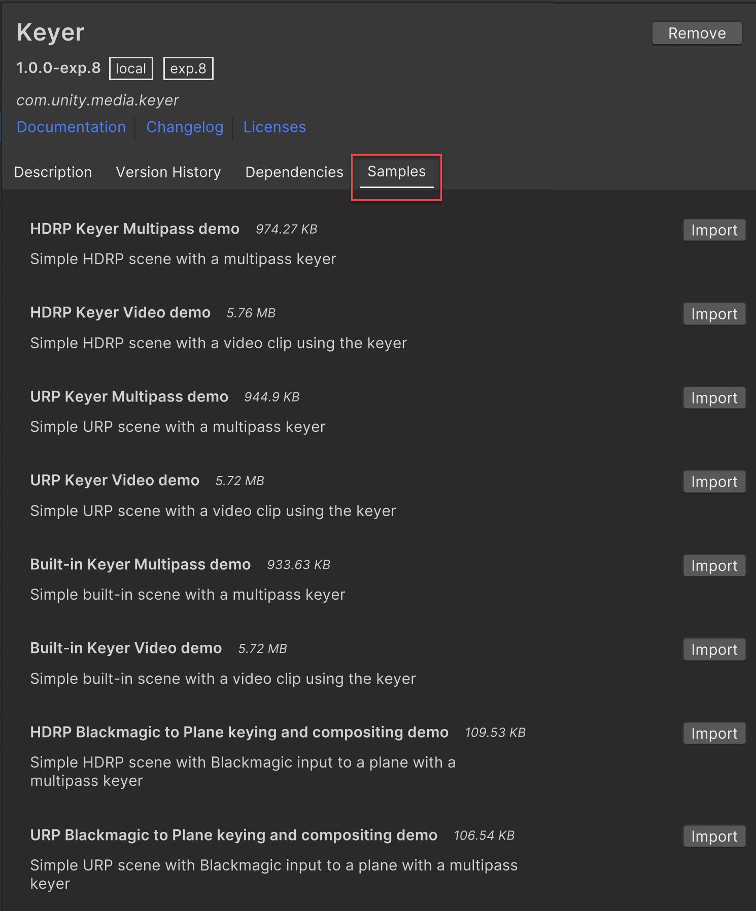

# Adding samples

The Keyer package has samples for each render pipeline (HDRP, URP, and Built-in). These samples are available directly from the Package Manager.

To add a sample to your project: 

1. Navigate to **Window > Package Manager**. 

2. Locate **Keyer** in the list of available packages, and select it. Under the package description, there is a list of available samples. 

3. Select **Import** next to the sample you wish to add.

Unity places imported samples in your Project's Asset folder under **Assets > Samples > Keyer > [version number] > [sample name]**.