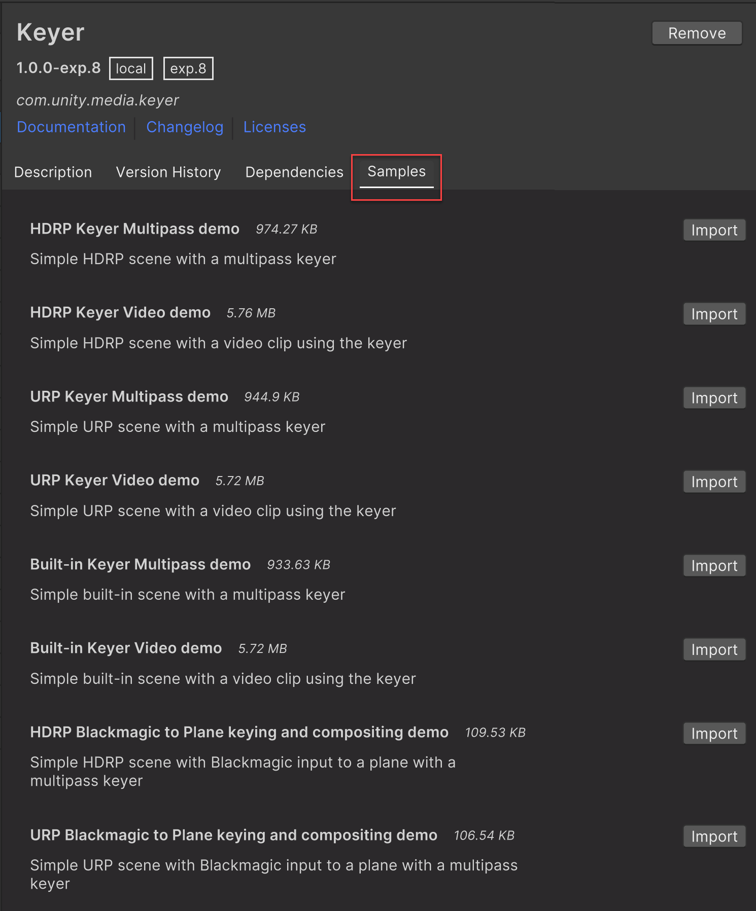

# Samples

The **Keyer** package comes with a set of samples to help you get started. A sample is a set of assets that you can import into your project and use as a base to build upon or learn how to use a feature.

