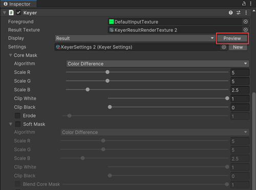
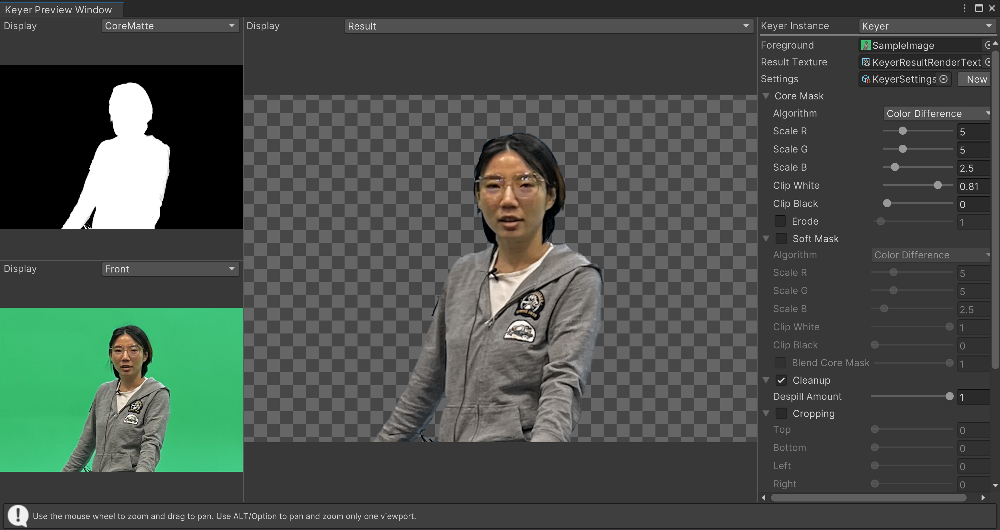
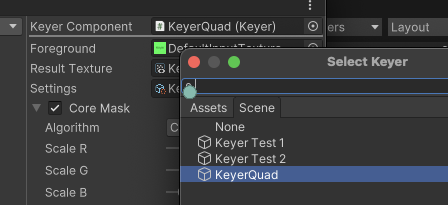

# Using the Keyer Preview Window

The Keyer Preview Window allows you to use 3 keying preview windows and the inspector to easily refine and view the intermediate results of your Key. 

To access the Keyer Preview Window, select **Preview** for the desired object.

 

Alternatively, you can also access the Keyer Preview Window by going to the menu and selecting **Window >  Virtual Production > Keyer Preview Window** and then select the **Keyer Component**.

By default, the pan and zoom is synchronized for all 3 windows. The pan is done using the left mouse button and the zoom by using the scroll wheel of the mouse. You can also use the ALT key to pan and zoom independently.

You can make your selection in the dropdown of each window to switch between Keying preview modes.

 

For example, choosing **result** in one of the 3 preview windows allows you to preview what is rendered in your final output.

You can also change the Keyer preview by clicking on the **Keyer Component** in the top right.

 