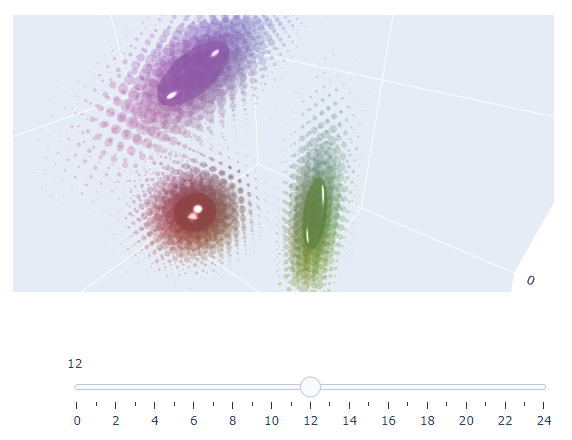
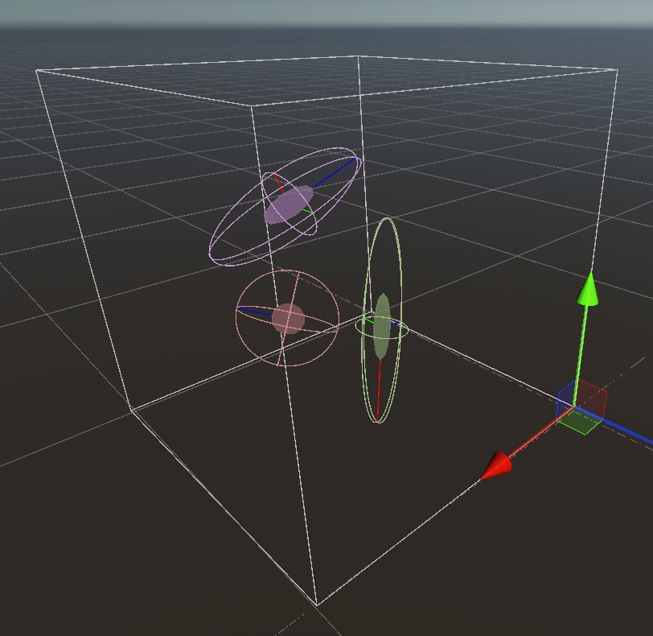

# Expectation Maximization

## Overview
Expectation Maximization (EM) is a clustering method. We think of an image as a collection of samples in RGB space (pixels). We want to model the distribution of colors in an image to better differentiate foreground and background. We assume that this distribution can be meaningfully represented by a multivariate Gaussian distribution. That is, we have a set of more or less spread out clusters of colors. That assumption is especially relevant for natural images. EM's purpose is to evaluate the parameters of this multivariate Gaussian distribution. That is, the centroid and covariance matrix of each individual Gaussian distribution.

It is an iterative method, so typically the more iterations the better the result. By nature, this type of algorithm can converge to local minimas, a problem we alleviate by carefully picking our initialization parameters.

## Implementation
The algorithm runs entirely on the GPU, using Compute Shaders. The `ExpectationMaximization` component is responsible for populating Command Buffers with the proper set of GPU calls as well as for managing the required Compute Buffers.

## Usage
We expect users to provide the algorithm with a set of colors, labeled as belonging to the foreground or the background. The algorithm will then evaluate the geometry of these clusters and refine their centroid. Then the Keyer, yet to be implemented, will be able to estimate the probability that a color sample belongs to the foreground or the background. We can imagine using these relative probabilities to build some kind of soft mask as well.

# Testing And Debugging
## Tooling
We provide tools for trying out the algorithm, unit testing it, developing it, and monitoring its performance. `ExpectationMaximizationDemo` allows us to analyze an image and visualize the evaluated distribution. The algorithm can run as a coroutine to better observe its convergence. The distribution can be exported at each step to later be visualized using a 3D visualization tool built using Python and the Plotly data visualization library. The python script is located at `Packages/com.unity.media.keyer/Scripts/clustering_viz.py`. As part of the data export process, we also generate a `.bat` file facilitating its consumption. Pass `--help` to the script for more information about its interface. Typically this is not necessary as we simply execute the generated `.bat` file to run the visualization. We added `RenderDocCapture` and `EditorBridge` to allow for the automatic GPU capture of execution steps. (The bridge is necessary as capture is an Editor feature that we must invoke from Runtime code.)

Note: Python dependencies can be installed using pip and the `requirements.txt` file provided.

## Unit Tests
We added unit tests to validate the proper behavior of EM, see `ClusteringTests`. These tests work by comparing the distribution extracted from a test image to the distribution used to generate that test image.

## Authoring Tests
To set up the above mentioned tests, we provide a `GaussianImageSynthesis` tool allowing to manually design a distribution and generate a procedural image from samples drawn from that distribution. Open the `Clustering` scene in the `KeyerGraphicsTestsHDRP` to take a look at it.

The distribution is a collection of clusters which are described as ellipsoids. We manually control the rotation and scale of these ellipsoids. From these parameters, we can evaluate the eigenvectors and eigenvalues of the cluster's covariance matrices. We provide a crude gizmo-based visualization of the distribution. Its basis vectors match those of the python visualization for easier comparison.

`GaussianSampler` allows us to draw random samples from a Gaussian distribution to populate the generated test image. We store both the serialized distribution parameters and the generated image in `GaussianDistribution`, which is then ready to be consumed by the unit tests.

Note that when manually configuring clusters, it is important to not have those clusters too close to the edges of the RGB space. Otherwise, the drawn samples get too clamped for the EM algorithm to reconstruct the clusters accurately. We have designed the tool accordingly. 
